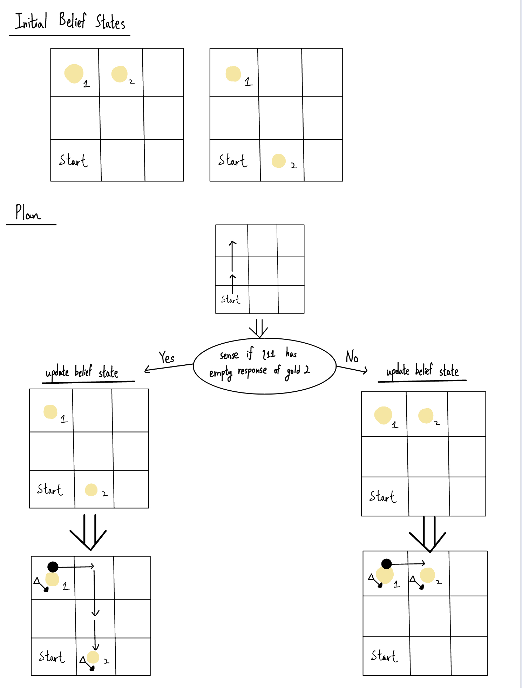
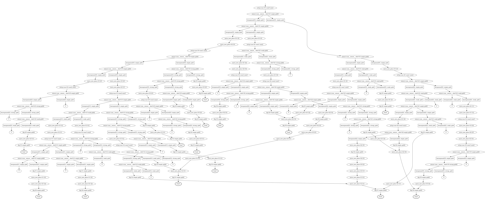

# 813_assn4
This is for Queen's University CISC 813 Course Assignment 4

# Team members
- E Ching (Noon) Kho, 17eck3@queensu.ca
- Andrew Boulos, 17ab86@queensu.ca
- Nathanael Yao, 18ny13@queensu.ca

# Inspiration
This domain was inspired by the metal detector tool that people sometimes use to find treasure, as demonstrated by the image.

# Problem
This game consists of a 3x3 grid with two pieces of gold hidden in two of the squares.
The player has the ability to travel horizontally and vertically across the grid.
The player can also scan each square and check if they receive a signal which would indicate that they are close to a metal. A strong signal would indicate that the metal is on their current location, a weak signal would indicate that they are one square away and an empty signal would indicate that they are more than one square away from that metal (In Manhattan distance).

## Logic for the problem setup
- The location of the two golds (3x3 means 72 choices)
- Each location will have a response for each metal
- The gold location implies the reponse signal of the world
- Starting Position
- Locations that never visited (can only visit each square once)
- Counter for the number of scan it can do (4)
- gold not obtained (since it is negative-preconditions setting)
- links (how to move from one location to another)

# Domain
## Predicate
There are **10** predicates:
- (metalLoc ?l1 - location ?g1 - metal ?l2 - location ?g2 - metal)
- (response ?loc - location ?s - signal ?m - metal)
- (goldAt ?loc - location ?m - metal)
- (gold_obtained ?m - metal)
- (at ?loc - location)
- (link ?l1 ?l2 - location)
- (never_been ?loc - location)
- (succ ?n1 ?n2 - num) ; For counting
- (can-scan ?loc - location)
- (scan-count ?n - num)

## Action
There are **4** actions:

- move_new_place
- setup-scan
- scan
- dig

### move_new_place
Move the person to a new square that they haven't visited yet. 

The person can only move to each square once.

### setup-scan
Limit the number of scans the person can make (4)

### scan
Observe the response from the metal detector 🔎 ┴┬┴┤( ͡° ͜ʖ├┬┴┬

### dig
The gold has been located, and the person is standing over it so now they can get the treasure

# Simple Case
If you go to the simple folder, it is a simple case where we only include 2 initial belief states for the location of the golds
(The purpose for the simple case is to see if the logic and plan is correct and reasonable)

Here's a drawing to explain the interpretation of the plan

# Result
The following is the plan that we able to obtain:

There are a few deadends either
- the person can not longer move to another unvisited square and both golds were not obtained.
- reach the max scan number and still can't figure out where the golds are

# Future work
- Test different number of max scan
- Unrestrict move_new_place so that you can revisit squares (maybe it will be strong solution?) (move_freely folder)
- Increase size of grid
- Increase number of golds